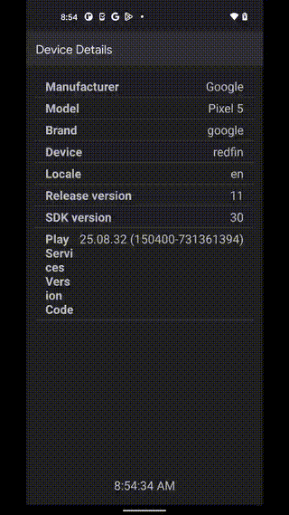

# Vibe

An ultra simple, free meditation app for Android.

## Features

- Elegant splash screen for a calming intro experience
- Simple and clean interface focused on meditation
- Meditation timer with customizable duration (5, 10, 15, 20, 25, 30, or 40 minutes)
- Meditation bell sounds and gentle vibration at the start and end of sessions
- Keeps screen active during meditation with wake lock
- Minimal permissions required (only vibration)

## Demo

<div align="center">
  
</div>

## Download

You can download the latest APK directly from the [GitHub Releases](https://github.com/patflynn/vibe/releases) page.

Each merge to the main branch automatically creates a new release with a timestamped version and downloadable APK.

## Development Setup

1. Clone the repository
2. Open the project in Android Studio
3. Build and run on your device or emulator

## Building the Project

```bash
# Build the project
./gradlew build

# Run tests
./gradlew test

# Install on connected device
./gradlew installDebug
```

## CI Status

[](https://github.com/patflynn/vibe/actions/workflows/android-ci.yml)

The CI pipeline:
- Builds and tests the app on every push and pull request
- Creates a downloadable APK artifact for every build
- Automatically publishes a new GitHub Release with the APK for merges to master
